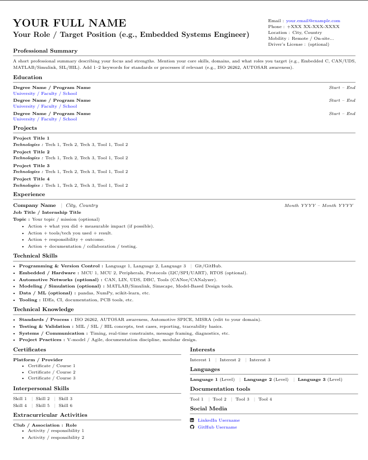
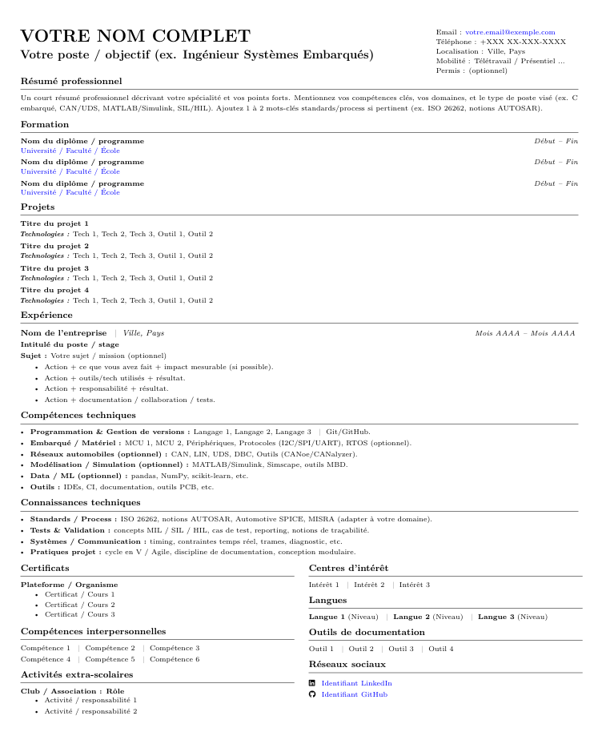

# 📄 One-Page CV Template (LaTeX) — EN + FR (Overleaf Ready)

A clean, compact **one-page A4** CV/Resume template in LaTeX, available in **English** and **French**.  
Designed to fit dense content while staying readable and professional.

---

## What’s inside
- **English template:** `templates/en/cv_template_en.tex`
- **French template:** `templates/fr/cv_template_fr.tex`

---

## Repository Structure

```
one-page-cv-template/
├─ templates/                     # LaTeX source files for CV templates
│  ├─ en/                            # English version
│  │  ├─ cv_template_en.tex              # Main LaTeX source file (English CV template)
│  │  └─ output_cv_en.pdf                # Example compiled PDF output (English CV)
│  └─ fr/                            # French version
│     ├─ cv_template_fr.tex             # Main LaTeX source file (French CV template)
│     └─ output_cv_fr.pdf               # Example compiled PDF output (French CV)
├─ screenshots/                   # Preview images for quick visualization
│  ├─ preview_en.png                 # Screenshot of English CV template
│  └─ preview_fr.png                 # Screenshot of French CV template
├─ README.md                      # Documentation and usage instructions
└─ LICENSE                        # License file 
```

<p align="center"> 
     
    &nbsp;&nbsp; 
     
</p>


---


## How to use on Overleaf

### Option 1 (Recommended): Upload manually
1. Open **Overleaf**.
2. Click **New Project** → **Blank Project**.
3. Name your project (example: `CV Template`).
4. Upload ONE file:
   - `templates/en/cv_template_en.tex` or `templates/fr/cv_template_fr.tex`
5. Rename the uploaded file to `main.tex`.
6. Click **Recompile**.

---

### Option 2: Import from GitHub
1. Open **Overleaf**.
2. Click **New Project** → **Import from GitHub**.
3. Select this repository and import it.

Then set the correct main file:
1. Click **Menu** (top-left).
2. Set **Main file** to ONE of:
   - `templates/en/cv_template_en.tex` (English)
   - `templates/fr/cv_template_fr.tex` (French)
3. Click **Recompile**.

> ⚠️ If Overleaf compiles the wrong file, fix it via **Menu → Main file**.
---

## Customization

Open the `.tex` file (EN or FR) and find the block:

- EN: `EDIT HERE (USER DATA)`
- FR: `MODIFIER ICI (DONNÉES)`

Replace placeholders like:
- `\CVName`
- `\CVHeadline`
- `\CVEmail`, `\CVPhone`, `\CVLocation`
- `\CVLinkedInURL`, `\CVGithubURL`
- `\CVSummary`

### Example
```tex
\newcommand{\CVName}{Your Name}
\newcommand{\CVHeadline}{Your Target Role}
\newcommand{\CVEmail}{you@email.com}
\newcommand{\CVPhone}{+123 456 789}
\newcommand{\CVLocation}{City, Country}
```

---

## Adding Entries

### Education
```tex
\eduentry{Degree / Program}{Start -- End}{University / Faculty / School}
```
Example:
```tex
\eduentry{MSc Embedded Systems}{2024 -- 2026}{University Name}
\eduentry{BSc Electronics}{2021 -- 2024}{University Name}
```

### Projects
```tex
\proj{Project Title}{Tech 1, Tech 2, Tool 1}
```
Example:
```tex
\proj{ACC Simulator with Virtual CAN}{Python, PySide6, Virtual CAN, Frame decoding}
```

### Experience
```tex
{\fontsize{8}{9}\selectfont
\company{Company Name} \sep \place{City, Country}\hfill {\MetaSize\textit{Month YYYY -- Month YYYY}} } \\
\role{Job Title / Internship Title}\\
{\MetaSize{\textbf{Topic :} Your topic / mission (optional)}}\\[-11pt]

{\fontsize{7}{9}\selectfont
\begin{itemize}[leftmargin=3em]
  \item Action + what you did + measurable impact.
  \item Action + tools/tech you used + result.
  \item Action + responsibility + outcome.
  \item Action + documentation / collaboration / testing.
\end{itemize}
}
```

---

## Keep it One Page
This layout is tuned for **one page**. If it spills onto a second page:
- Shorten bullet points
- Remove less important items
- Keep summary to ~3–5 lines
- Avoid changing margins unless necessary

---

## Optional Customization
Change accent color in the preamble:
```tex
\colorlet{AccentColor}{blue}
```
Replace `blue` with `black`, `teal`, `purple`, `gray`, etc.

---

## 🙌 Credit

Created and maintained by **MOKHTARI Anass**. 
